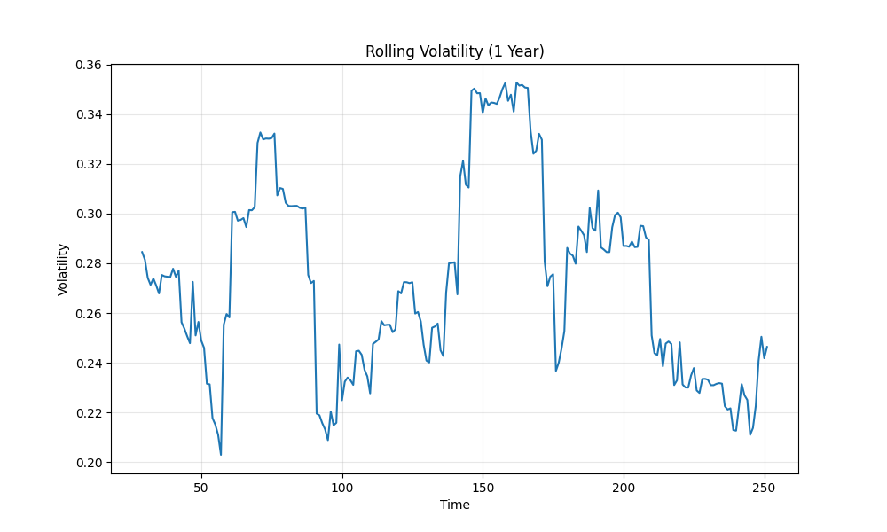
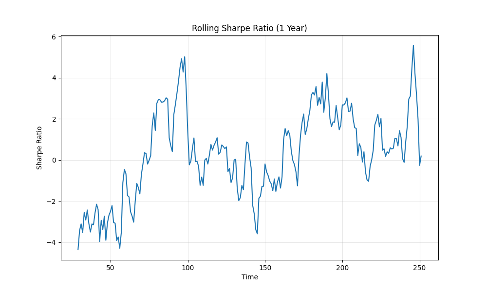

# Quant Portfolio Analytics with Monte Carlo Simulation


This project builds a quantitative portfolio analytics engine in Python to simulate asset returns, construct optimized portfolios, and evaluate portfolio risk using institutional performance metrics.

The model uses **Monte Carlo simulation with multivariate Student-t distributions** to capture fat-tail behaviour commonly observed in financial markets.

---

## Key Features

• Monte Carlo simulation of asset returns  
• Fat-tail modeling using Student-t distribution  
• Portfolio optimization:
  - Minimum Variance Portfolio
  - Risk Parity Portfolio
  - Equal Weight Benchmark  
• Efficient Frontier generation  
• Sharpe ratio distribution analysis  
• Return distribution vs normal distribution  

---

## Risk Analytics

The project computes key portfolio risk metrics used in quantitative asset management:

- Expected Return
- Volatility
- Sharpe Ratio
- Value at Risk (VaR 95%)
- Conditional VaR (CVaR 95%)
- Maximum Drawdown
- Calmar Ratio

---

## Example Output & Risk Visualizations

### Efficient Frontier


### Sharpe Ratio Distribution


### Portfolio Drawdown


### Portfolio Growth


### Rolling Volatility


### Rolling Sharpe Ratio


---

## Project Structure

```
Quant-Portfolio-Analytics
│
├── Data
│   └── stocks.csv
│
├── src
│   ├── main.py
│   ├── monte_carlo.py
│   ├── optimizers.py
│   └── data_loader.py
│
├── results
│   ├── efficient_frontier.png
│   ├── sharpe_distribution.png
│   ├── drawdown.png
│   ├── portfolio_growth.png
│   ├── rolling_volatility.png
│   └── rolling_sharpe.png
│
└── README.md
```

---

## Technologies Used

- Python
- NumPy
- Pandas
- Matplotlib
- SciPy

---

## Motivation

The goal of this project is to build a research-style portfolio analytics framework similar to tools used in quantitative asset management and systematic trading.

It demonstrates portfolio construction, risk measurement, and Monte Carlo simulation techniques commonly used in quantitative finance.

---

## Research Summary

This project implements a Monte Carlo based portfolio analytics framework to evaluate portfolio risk under heavy-tailed return distributions.

Asset returns are simulated using a **multivariate Student-t distribution** to better capture fat-tail risk observed in financial markets.

Portfolio construction methods evaluated:

- Minimum Variance Portfolio
- Risk Parity Portfolio
- Equal Weight Benchmark

The simulation framework allows comparison of portfolio performance using institutional risk metrics such as **Sharpe Ratio, Value-at-Risk (VaR), Conditional VaR, and Maximum Drawdown.**

---

## Portfolio Risk Statistics Example

Example output from the simulation:

Expected Return: -3.83%  
Volatility: 27.40%  
Sharpe Ratio: -0.21  
VaR (95%): -2.87%  
CVaR (95%): -3.73%  
Max Drawdown: -21.01%  
Calmar Ratio: -0.18  

---

## Data Source

Market data is retrieved using the **yfinance** Python library from Yahoo Finance.

The project automatically downloads historical prices for the tickers listed in `Data/stocks.csv`.

---

## Sample Portfolio

The example portfolio used in this project consists of a small basket of equities for demonstration purposes.

Tickers are stored in:

```
Data/stocks.csv
```

Example:

```
Reliance
HDFC
Infosys
Wipro
```

The system automatically downloads historical price data and computes portfolio returns for simulation.

---

## How to Run

Clone the repository:

```bash
git clone https://github.com/piyushsinha0987-glitch/quant-portfolio-analytics.git
```

Navigate to the project folder:

```bash
cd quant-portfolio-analytics
```

Install dependencies:

```bash
pip install -r requirements.txt
```

Run the analytics engine:

```bash
python src/main.py
```

---

## ⭐ Support the Project

If you found this project useful or interesting, please consider **starring the repository** on GitHub.  
It helps others discover the project and supports future development.
