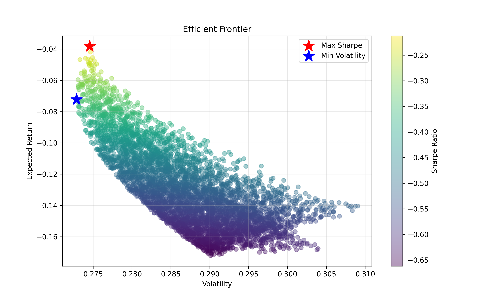
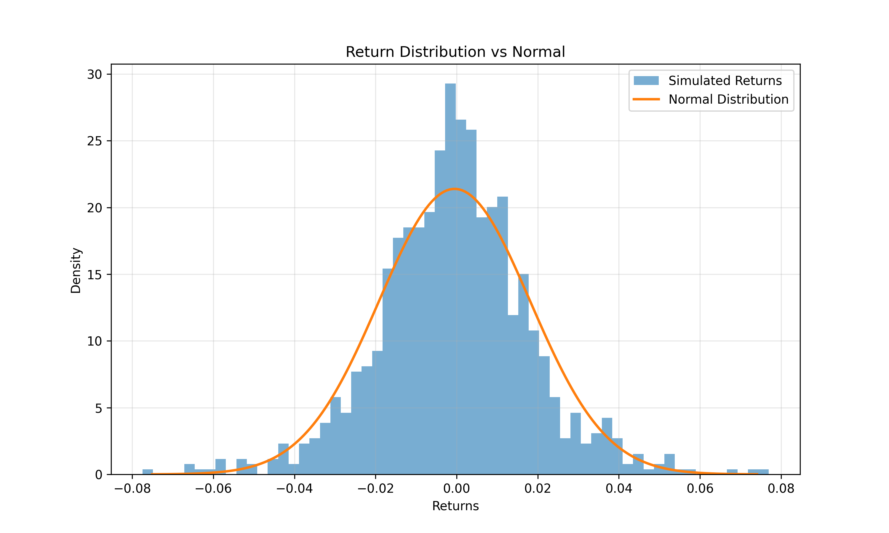
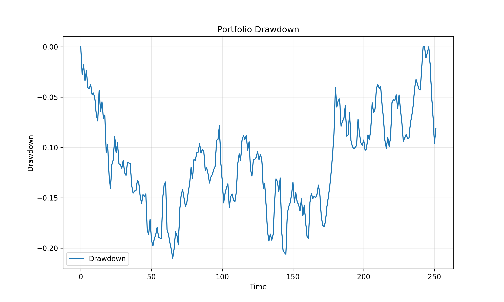
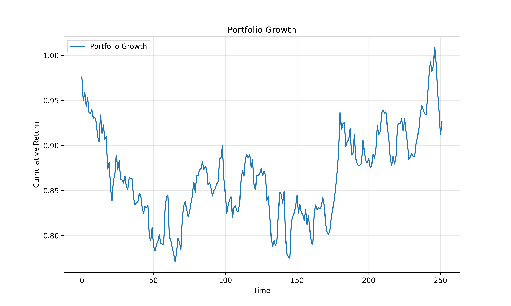

# Quant Portfolio Analytics with Monte Carlo Simulation

This project builds a quantitative portfolio analytics engine in Python to simulate asset returns, construct optimized portfolios, and evaluate portfolio risk using institutional performance metrics.

The model uses **Monte Carlo simulation with multivariate Student-t distributions** to capture fat-tail behaviour commonly observed in financial markets.

---

## Key Features

• Monte Carlo simulation of asset returns  
• Fat-tail modeling using Student-t distribution  
• Portfolio optimization:
  - Minimum Variance Portfolio
  - Risk Parity Portfolio
  - Equal Weight Benchmark  
• Efficient Frontier generation  
• Sharpe ratio distribution analysis  
• Return distribution vs normal distribution  

---

## Risk Analytics

The project computes key portfolio risk metrics used in quantitative asset management:

- Expected Return
- Volatility
- Sharpe Ratio
- Value at Risk (VaR 95%)
- Conditional VaR (CVaR 95%)
- Maximum Drawdown
- Calmar Ratio

---

## Example Output

### Efficient Frontier



### Sharpe Ratio Distribution



### Portfolio Drawdown



### Portfolio Growth



---

## Project Structure

```
Quant-Portfolio-Analytics
│
├── Data
│   └── stocks.csv
│
├── SRC
│   ├── main.py
│   ├── monte_carlo.py
│   ├── optimizers.py
│   └── data_loader.py
│
├── results
│   ├── efficient_frontier.png
│   ├── sharpe_distribution.png
│   ├── drawdown.png
│   └── portfolio_growth.png
│
└── README.md
```

---

## Technologies Used

- Python
- NumPy
- Pandas
- Matplotlib
- SciPy

---

## Motivation

The goal of this project is to build a research-style portfolio analytics framework similar to tools used in quantitative asset management and systematic trading.

It demonstrates portfolio construction, risk measurement, and Monte Carlo simulation techniques commonly used in quantitative finance.

---

## Portfolio Risk Statistics Example

Example output from the simulation:

Expected Return: -3.83%  
Volatility: 27.40%  
Sharpe Ratio: -0.21  
VaR (95%): -2.87%  
CVaR (95%): -3.73%  
Max Drawdown: -21.01%  
Calmar Ratio: -0.18


## How to Run

1. Clone the repository

git clone https://github.com/piyushsinha0987-glitch/quant-portfolio-analytics.git

2. Install dependencies

pip install -r requirements.txt

3. Run the simulation

python SRC/main.py

4. Results will be saved in the results/ folder

## Future Improvements

- Add Sortino Ratio
- Rolling volatility analysis
- Rolling Sharpe ratio
- Additional Monte Carlo simulation methods
